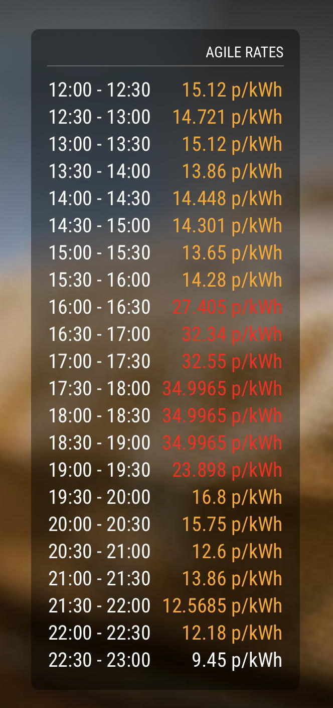

# MMM-OctoAgileMon

"Octopus Agile Monitor", displays agile octopus rates

## Example



## Dependencies

* An installation of [MagicMirror<sup>2</sup>](https://github.com/MichMich/MagicMirror)
* An electricity supply account with Octopus Energy and a smart electricity meter

## Installation

1. Clone this repo into `~/MagicMirror/modules` directory, to create `~/MagicMirror/modules/MMM-OctoAgileMon`.

```
	cd ~/MagicMirror/modules
	git clone https://github.com/MystaraTheGreat/MMM-OctoAgileMon.git
```

1. Add AgileOctoMon configuration into `~/MagicMirror/config/config.js`:

```
	{
		module: 'MMM-AgileOctoMon',
		position: 'bottom_right',
		header: ' Octopus Energy',
		config: {
				elecApiUrl: 'https://api.octopus.energy/v1/products/AGILE-18-02-21/electricity-tariffs/E-1R-AGILE-18-02-21-C/standard-unit-rates/',
				api_key: '[YOUR-API-KEY]',
				displayTimes: 24,
				elecCostSC: 0.25,
				showUpdateTime: true,
				updateInterval: 60000*60,
				retryDelay: 5000,
				animationSpeed: 2000,
		}
	},
```

1. Obtain your API key from the Octopus Energy website, by signing into your account, then click 'Menu' -> 'My Account' -> 'Account Information'. Scroll to bottom of page and click 'API Access'. This page will also provide you with the electricity meter's MPAN and Serial numbers, and the gas meter's MPRN and Serial numbers, which need to be replaced above.

## Configuration options

The following config.js properties can be configured.

| **Option** | **Default** | **Description** |
| --- | --- | --- |
| 'header' | 'octobw.jpg' | other graphics available in the 'public' directory, or just remove it |
| 'displayTimes' | '24' | The number of times to show the rate for |
| 'elecMedium' | '10' | kWh values over this amount will be displayed in Orange |
| 'elecHigh' | '20' | kWh values over this amount will be displayed in Red |
| 'elecCostKWH' | '0.1372' | cost per kWh in pounds, or zero to hide display |
| 'elecCostSC' | '0.25' | daily standing charge in pounds |
| 'decimalPlaces' | '1' | round all kWh values to this number of decimal places |
| 'showUpdateTime' | 'true' | true or false, to display the time the energy usage figures were last updated |
| 'updateInterval' | '60000\*60' | delay between refresing energy usage via the API, in milliseconds (1 hour, or 60 * 60 seconds) |
| 'retryDelay' | '5000' | delay between failing to get a valid result from the API and trying again in milliseconds (5 seconds) |
| 'animationSpeed' | '2000' | fade in/out speed in milliseconds (2 seconds) |

## Disclaimer

This is a hack of MMM-OctoMon, which itself is described as a hack.
